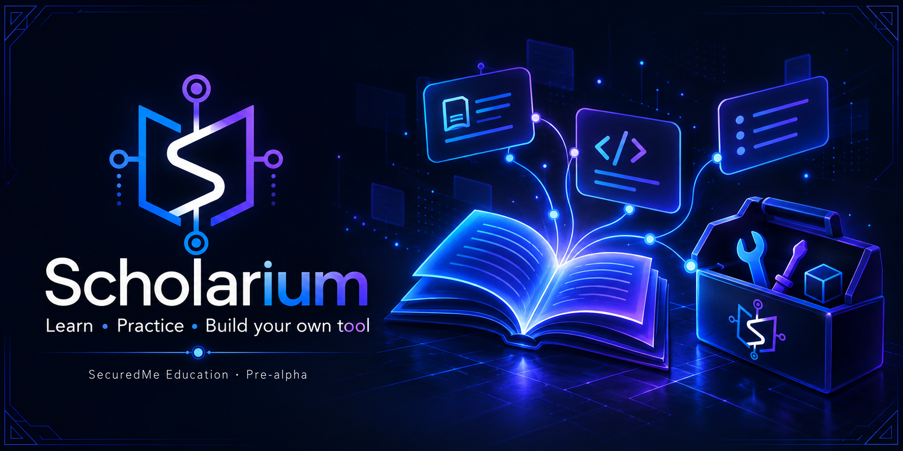

# SecuredMe Scholarium



[](LICENSE)
[](AGENTS.md)
[](https://github.com/SeCuReDmE-main-dev/securedme-scholarium/issues)
[](https://github.com/SeCuReDmE-main-dev/securedme-scholarium/commits/main/)
[](https://e2b.dev/startups)

Organize supervised teaching, tool practice, documentation and confidential safety review.

[Public surface](https://scholarium.securedme.ca/) · [Tool documentation](https://securedme-main-dev.github.io/securedme-scholarium/en/tools/scholarium/) · [Education hub](https://securedme.ca/product/education/)

**Status:** pre-alpha, active public development. Public pages and a successful local test do not establish a deployed school service. E2B sponsorship recognition is separate from runtime availability and included quota.

## How it works

The web application uses Vinext/React, versioned API contracts and D1 storage. Roles, idempotent case actions, decision history and appeals remain product data, separate from technical metrics.

## Local development

Record the checkout and existing changes before editing:

```powershell
git status --short --branch
git rev-parse HEAD
```

In a clean development checkout, use the committed lockfile or package manifest. The commands below are setup instructions, not a claim that every dependency or optional service has been verified:

```powershell
Set-Location apps/web
npm ci
npm run dev
```

Run the relevant local checks from the repository root; the indicated `Set-Location` is needed only when starting from that root:

```powershell
Set-Location apps/web
npm test
npx --no-install tsc --noEmit
```

## Source map

- [apps/web/app](apps/web/app)
- [apps/web/tests](apps/web/tests)
- [apps/web/drizzle](apps/web/drizzle)
- [docs/getting-started/15-minute-tutorial.md](docs/getting-started/15-minute-tutorial.md)
- [tools/webmcp-product-matrix.json](tools/webmcp-product-matrix.json)

## Practice exercise

Follow the fifteen-minute tutorial with synthetic data, inspect one tool action and review its output. Reject an action when the session or role does not authorize it.

During an individual course, learners choose suite tools to practice. The eight-week final project is the learner's own tool, submitted by the learner to an eligible hackathon after checking its age, AI, originality and licensing rules.

## Boundaries and privacy

The additive safety migration is prepared locally and has not been applied to live D1. Software tests do not establish institutional approval, legal suitability or protection of minors. Training sales remain inactive pending contract validation.

The official school routes are Codex/OpenAI and Antigravity/Gemini with human review. Never distribute raw tokens, learner data, prompts or private correspondence. No hidden learner analytics are added. Public analytics require explicit consent; general autocapture and session replay remain disabled. Optional local technical telemetry is separate from learner records and product audit history.

See [AGENTS.md](AGENTS.md) and [SCHOOL_TOOL_GOVERNANCE.md](SCHOOL_TOOL_GOVERNANCE.md) for current authority and provider boundaries. Maintainer-authorized maintenance follows repository protections and required reviews. General contribution restrictions remain governed by [CONTRIBUTING.md](CONTRIBUTING.md).

## License, authorship and history

The repository's actual license is [SEL-2.0](LICENSE). Keep the license, attribution, notices and safety boundaries when reusing the code.

Jean-Sebastien Beaulieu · [ORCID 0009-0007-2904-0443](https://orcid.org/0009-0007-2904-0443) · [SecuredMe](https://securedme.ca/)

[README source before curation](docs/archive/README-before-curation-2026-09-30.txt) retains the exact previous text, implementation journals and attribution. It is historical: its old telemetry commands, readiness claims and contribution dates are not current operating instructions. [Presentation history](docs/repository-presentation-history-2026-09-30.md) retains previous badges. [GitHub social image](docs/assets/repository/github-social-preview-2026.jpg) accompanies this README.
