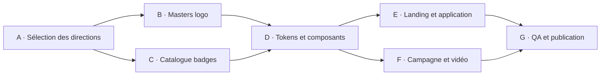

# Scholarium — système d'identité et plan des assets

**État :** plan d'exécution. Aucun fichier sous `assets/` n'a été déplacé, renommé, compressé ou publié par ce plan.

## 1. Décision directrice

Scholarium doit appartenir visuellement à SecuredMe Education sans devenir une copie générique de la suite.

```text
SecuredMe                         marque institutionnelle
└── SecuredMe Education           système partagé, garantie de cohérence
    └── Scholarium                produit : connaissance, provenance, impact
        ├── Publication / recherche
        ├── Communauté / apprentissage
        └── Réussites / reconnaissance non marchande
```

La règle de gouvernance reste `I -> I_system^S -> D_f -> dF -> i_fractal` : un détail visuel local ne peut jamais contredire l'identité produit, le système Education ou les invariants de Scholarium.

## 2. Résultat de l'audit des assets

| Famille existante | État observé | Rôle recommandé | Décision de traitement |
| --- | --- | --- | --- |
| `securedme/education/*` | 2 logos et 2 bannières, palette documentée | identité de suite / co-branding | source officielle, conserver sans modification |
| `logo final concept/1.png` | planche de direction 1254×1254 | référence de la marque Scholarium | ne pas livrer telle quelle; extraire ou recréer un vrai master vectoriel approuvé |
| `icon asset pack/1.png` et `10.png` | planches dark/light de marque et tailles produit | système d'icônes, favicon, app icon | sélectionner une variante canonique, puis produire des exports dédiés |
| `badge/dark/1..10.png`, `badge/light/1..10.png` | 20 planches de badges 1254×1254 | reconnaissance de contribution et de parcours | convertir en catalogue sémantique; jamais en statut payant |
| `web banner/1..10.png` | 10 compositions 1672×941 | campagne, landing, OpenGraph et social | retenir 1 direction dark et 1 direction light; décliner à partir d'un layout source |
| `video/Architecting_the_AI-Resilient_Research_Commons.mp4` | film de 66 MB | teaser Studio / recherche | stocker hors bundle, créer vignette, sous-titres et transcription avant publication |

### Constats qui influencent la décision

- La famille est cohérente : marine profond, bleu électrique, violet vif, or savant, hexagone/folio et réseau de nœuds.
- Les PNG sont des **planches de conception**, pas des livrables de production : ils contiennent plusieurs tailles, labels et textes intégrés.
- Les mentions **Premium**, **Premium Activation**, **Gold Mode** et **Tier 4** ne sont pas des textes produit autorisés pour Scholarium. Elles peuvent guider le traitement visuel de la reconnaissance, mais sont incompatibles avec l'invariant zéro pay-to-rank.
- La bannière web dark `web banner/2.png` est la meilleure direction candidate pour une campagne de découverte; `web banner/10.png` est la meilleure candidate claire. Leur texte devra être remplacé par le message validé de Scholarium.

## 3. Contrat de marque à appliquer

### Tokens proposés — à valider par contraste avant intégration

| Token | Valeur de départ | Usage |
| --- | --- | --- |
| `--brand-navy` | `#0B0E1A` | fonds sombres, lecture longue, cadre institutionnel |
| `--brand-blue` | `#1A73FF` | actions, liens, état actif |
| `--brand-violet` | `#6F42FF` | signal secondaire, créations et connexions |
| `--brand-gold` | `#DAAF37` | uniquement provenance vérifiée, jalon gagné, distinction non financière |
| `--brand-ivory` | `#FAF7F0` | fond clair et confort de lecture |
| `--brand-ink` | `#10172F` | texte principal sur fond clair |

L'or ne représente jamais un abonnement, un rang social, une visibilité achetée ou une capacité éditoriale payante.

### Hiérarchie de messages

1. **Scholarium** : *Knowledge · Provenance · Impact*.
2. **Promesse produit** : connaissance connectée, explicable et attribuée.
3. **SecuredMe Education** : endossement discret dans le shell, le footer et les pages de suite.
4. **Récompenses** : contribution vérifiable, apprentissage, aide communautaire, qualité de provenance.

## 4. Arborescence cible — ne pas créer avant approbation des sélections

```text
apps/web/public/brand/
  identity/
    scholarium-mark.svg
    scholarium-wordmark-dark.svg
    scholarium-wordmark-light.svg
    securedme-education-lockup-dark.svg
    securedme-education-lockup-light.svg
  icons/
    favicon.svg
    app-icon-192.png
    app-icon-512.png
    icon-map.json
  badges/
    spark.{dark,light}.webp
    connection.{dark,light}.webp
    structure.{dark,light}.webp
    growth.{dark,light}.webp
    mastery.{dark,light}.webp
    badge-catalog.json
  campaigns/
    scholarium-discover-dark-1600.webp
    scholarium-structured-light-1600.webp
    scholarium-og-1200x630.webp
  video/
    architecting-research-commons-poster.webp
```

Les masters originaux restent dans un espace de design privé ou dans R2; le dépôt ne reçoit que des dérivés optimisés, licenciés et réellement utilisés par le produit.

## 5. Plan d'exécution

| Lot | Actions atomiques | Dépend de | Preuve de réussite |
| --- | --- | --- | --- |
| A. Décision de marque | choisir un mark dark, un mark light, une bannière dark, une bannière light; confirmer les mots interdits | audit des assets | fiche de sélection signée avec 4 fichiers sources et justification |
| B. Masters de production | obtenir ou recréer un SVG de mark/wordmark; définir zone de protection, tailles minimales, variantes monochromes | A | exports nets à 16, 32, 48, 192 et 512 px; aucune planche composite utilisée comme logo |
| C. Catalogue de badges | attribuer un nom, une condition, une icône, un texte alternatif et une variante claire/sombre à chaque badge | A | `badge-catalog.json` sans “premium”, prix ou avantage de classement |
| D. Système de design | intégrer les tokens, composants `BrandMark`, `SuiteLockup`, `Badge`, `CampaignHero`; mesurer contraste WCAG AA | B, C | Story/catalogue rendu dans les thèmes clair, sombre et contraste élevé |
| E. Landing et application | remplacer le mark temporaire, favicon, OpenGraph et hero; garder le produit lisible sans image décorative | D | captures desktop/tablette/mobile et poids initial respecté |
| F. Vidéo et campagne | extraire poster, sous-titres et transcription du film; préparer les formats social | D | vidéo accessible avec poster, sous-titres et transcription publiable |
| G. Publication et gouvernance | optimiser WebP/AVIF, documenter licences, ajouter tests de chemins et alt text, publier | E, F | build vert, aucun fichier de plusieurs MB dans le bundle initial, inventaire de provenance complet |

## 6. Séquence recommandée



## 7. Choix technologiques — décision RagGgE

| Besoin | Choix | Niveau | Justification | Revoir quand |
| --- | --- | --- | --- | --- |
| logos et favicon | SVG master versionné | T1 — éprouvé | netteté, accessibilité, tailles très faibles, aucun recadrage raster | un master officiel change |
| bannières et OG | WebP/AVIF dérivé à la compilation | T1 — éprouvé | réduit fortement les PNG de 1.4–2.0 MB; conserve le design | le CDN impose un format plus performant |
| badges | catalogue de métadonnées + image dérivée | T1 — éprouvé | sépare les règles de reconnaissance du visuel; évite les promesses cachées | le système de réussite devient dynamique |
| vidéo | R2/Stream, poster et sous-titres séparés | T1/T2 | ne bloque pas le chargement initial de l'app; compatible accessibilité | volume vidéo ou Live justifie Stream |
| génération d'icônes à l'exécution | rejetée | T4 — à éviter | coût, incohérence et impossibilité de garantir contraste/identité | jamais sans master validé |

## 8. Conditions de non-publication

- absence de master vectoriel approuvé pour l'icône ou le logo;
- texte “Premium”, prix ou privilège de classement dans un badge ou une bannière Scholarium;
- contrastes AA non vérifiés pour les textes placés sur image;
- bannière servant de texte indispensable à la compréhension d'une page;
- vidéo sans sous-titres, poster et transcription;
- export non licencié, source inconnue ou origine non documentée.

## 9. Prochaine décision utilisateur

Avant toute intégration visuelle, confirmer une direction primaire :

- **Dark research commons** : référence `web banner/2.png`, riche, éditoriale, centrée provenance/recherche;
- **Light structured knowledge** : référence `web banner/10.png`, claire, institutionnelle, plus proche des environnements d'apprentissage;
- **Dual theme** : dark pour campagne/Studio, light pour lecture et espace Education, avec le même mark vectoriel.

La recommandation est **Dual theme** : elle respecte les deux familles déjà produites, réduit la fatigue de lecture, et maintient le dark mode comme choix de confort plutôt que comme une simple décoration.
