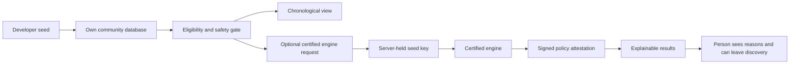

# Scholarium Seed Protocol

`scholarium-seed/v1` lets a developer build an independent version of the platform while preserving the core safety and discovery commitments. The copyable kit lives at [`templates/scholarium-seed`](../templates/scholarium-seed).

## The mechanism

### 1. Public Seed — available now

The seed contains the typed candidate and explicit-preference contract, chronological fallback, SEL-2.0 attribution path, environment placeholders, and a server-only HMAC client. A developer may make an independent discovery implementation, provided it does not present itself as the official or certified Scholarium engine.

### 2. Certified Engine — provisioned separately

The protected implementation must live in a private server repository and be run as a separate service. A registered seed calls it from its server with a seed ID, audience, timestamp, and HMAC request signature. The engine returns reasons, score lanes, a policy digest, expiry, and a signed attestation claim. The seed verifies the Ed25519 signature, expiry, policy digest, and ordered result IDs with the engine’s public key before displaying the “Certified Plithogenic Engine” mark.

No engine endpoint, key, registration, or certification mark is active in this repository today. The current status is deliberately `not_provisioned`.

### 3. What is actually protected

| Asset | Protection mechanism | Limitation |
| --- | --- | --- |
| Public seed code and documentation | SEL-2.0 terms, copyright notices, attribution, and fork naming rules | A public repository is inspectable. |
| “Scholarium” and “Certified Plithogenic Engine” identity | Maintainer-controlled brand and explicit certification criteria | Formal trademark registration is a separate legal decision. |
| Future engine implementation, calibration, and abuse controls | Private repository, least-privilege access, key rotation, confidentiality terms, auditable registrations | It is a trade secret only while it remains confidential. |
| Per-response integrity | Server-held HMAC request authentication plus engine signature and expiry | Signatures prove origin/integrity; they do not make a disclosed formula secret. |

Copyright protects code and its expression, not the underlying ideas, methods, or systems. A publicly disclosed formula cannot truthfully be treated as a trade secret; the confidential engine must contain genuinely non-public implementation and controls. [U.S. Copyright Office](https://www.copyright.gov/help/faq/faq-protect.html) · [WIPO trade-secret guidance](https://www.wipo.int/en/web/trade-secrets/protection)

## Non-negotiable discovery invariant

Every certified seed must preserve:

1. eligibility and safety resolution before ranking;
2. a chronological alternative;
3. only private, explicit favourite and less-like-this signals;
4. no paid reach, global-like popularity, passive watch time, contact graph, or biometric input;
5. visible reasons and a policy digest;
6. separate, reviewable moderation and scientific-evidence decisions.

## Certification rollout gate

Before enabling the certified label, the maintainer must provision a private engine, register each seed, set server-only secrets in the seed host, publish the engine public key, implement replay protection and request limits, write a key-rotation process, and independently test an invalid signature, expired attestation, replayed timestamp, and unavailable-engine fallback.

Until then, a seed must stay in chronological or independently implemented discovery mode and may not imply engine certification.
