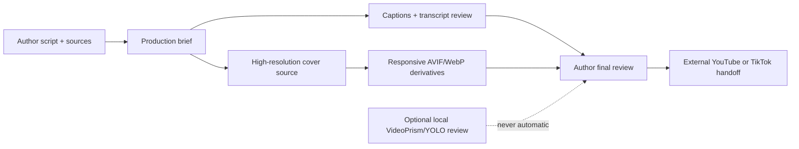

# Podcast & Video Studio boundary

Scholarium’s Podcast & Video Studio turns an author’s title, spoken script, source link, and intended aspect ratio into a local, ephemeral production brief. It is a coaching surface, not a hosted video renderer or an automatic publisher.

## What the studio creates

- A master-format recommendation: 1920 × 1080 landscape, 1080 × 1920 vertical, or 1080 × 1080 square.
- A caption/transcript and source checklist before a publication is linked to a provider.
- A cover-image brief that starts with a real high-resolution original and derives web variants without enlarging a weak source.

Cloudflare’s image transformations can resize, convert, and cache modern image formats at the edge; they do not restore detail that was never present in a small or heavily compressed original. [Cloudflare Images transformations](https://developers.cloudflare.com/images/optimization/transformations/overview/) · [Cloudflare media optimization](https://developers.cloudflare.com/use-cases/media-streaming/image-optimization/)

## VideoPrism and local vision boundary

VideoPrism is a video-understanding encoder supporting tasks such as classification, retrieval, localization, captioning, and question answering. It is **not** an image upscaler or a scientific-truth detector. Scholarium therefore reserves it for a future author-approved, local script-to-scene review rather than putting its large model or a private video archive into the public web application. [Google Research: VideoPrism](https://research.google/blog/videoprism-a-foundational-visual-encoder-for-video-understanding/)

The local CodeProject.AI node may later run a small, opt-in YOLO or scene check to flag framing or missing visual context. It is never started automatically, does not identify people, does not create biometric profiles, and cannot change feed reach or publication status.

## Provider boundary

The finished video remains with the author’s chosen provider. Scholarium stores an attributed canonical YouTube or TikTok link and the surrounding research context; OAuth, direct posting, provider audit, and final visibility choice remain explicit provider-controlled steps. See [VIDEO-INTEGRATION-BOUNDARY.md](VIDEO-INTEGRATION-BOUNDARY.md).

## Legacy repositories

On 2026-07-11, the referenced `podcast-to-video` and `video-podcast-tool` repositories returned `404` to both the GitHub connector and the public repository page. Their code has not been copied or represented as active in this implementation. If access is restored, assess their license, dependencies, secret handling, rendering commands, and test coverage before importing a bounded module.
