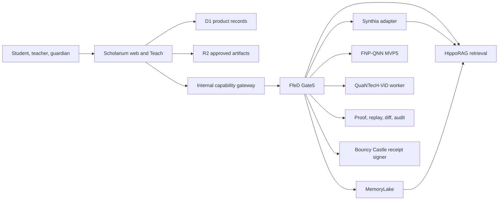

# Scholarium Teach architecture

## Boundary map

Scholarium Teach is a domain of the existing application and identity model. The web bundle does not import `pluginpack`, the FfeD kernel, HippoRAG, or media workers. Every external computation crosses a versioned capability contract.

## Data hierarchy

1. Shared approved education corpus.
2. Private per-person, per-role learning graph.
3. School aggregate projections.
4. School-commission aggregate projections.

Raw private graph content does not move upward. Aggregate projection must enforce cohort thresholds, purpose limitation, and anti-reconstruction tests.

Assistant cooperation follows the same hierarchy. The learner assistant owns
the private graph. Teacher assistants receive only course-authorized summaries
for learners with active learning consent. Administrative assistants receive
organization-authorized aggregates only when the cohort contains at least 10
learners. Cross-assistant messages use expiring, idempotent, receipt-bearing
projections and never embed the private graph or raw answers.

## Authority boundaries

- AI structures, retrieves, explains, and traces; it does not become pedagogical, scientific, taxonomic, clinical, legal, or disciplinary authority.
- Synthia preserves `I -> I_system^S -> H_lex -> G_lex -> I_lexicon`.
- Synthia and FNP-QNN preserve `I -> I_system^S -> D_f -> dF -> i_fractal`.
- HippoRAG runs behind a retrieval-only facade. Its answer-generation methods are disabled; Codex or Gemini receives reviewed passages and owns user-facing language.
- QuaNthoR coaches form and prepares handoffs; it does not certify truth or proof.
- Geometry can address, partition, project, replay, and compare. Penrose or physics values never enter KDF, AAD, vault, or key material.
- The transitional Bouncy Castle level signs terminal private-worker receipts with Ed25519. It consumes digests only, stores no key locally, and never enters the browser or Cloudflare bundle.

## Failure behavior

- Missing optional research workers degrades Teach to the local deterministic learning loop.
- An invalid plugin manifest or digest fails closed before invocation.
- RAG production queries use approved sources only; pending and quarantined graphs are isolated.
- Media remains a prepared request until a user-triggered worker and separate publication confirmation exist.
- Datadog receives technical metadata only.

## Agent execution containment

Private workers follow a three-part execution contract aligned with the Docker 3C model:

- **Contain:** FNP-QNN, Synthia, HippoRAG, media, and observability workers run outside the Cloudflare bundle with bounded process, network, filesystem, CPU, memory, and time scopes.
- **Curate:** every worker receives an explicit allowlist of inputs, paths, environment variable names, source partitions, and capabilities. Student records and the central `.env` are never mounted wholesale.
- **Control:** Gate5 verifies identity, purpose, consent receipt, manifest digest, quota, expiry, and replay state before invocation. A denied or expired request stops before worker execution.

Containers are an implementation option for private workers, not a product-wide requirement. Existing FNP-QNN and Datadog Compose surfaces must be hardened before use with learner data; Scholarium web, D1, and R2 remain separately deployed.
