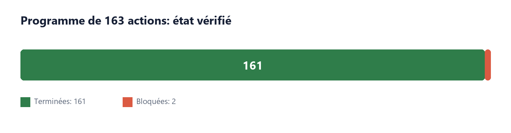
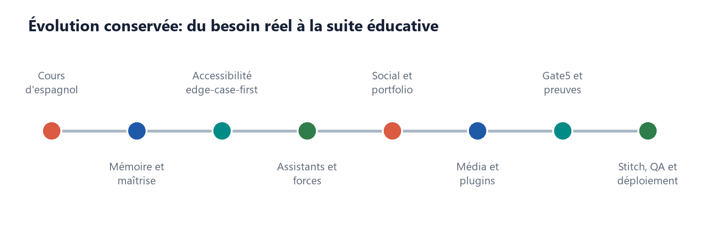
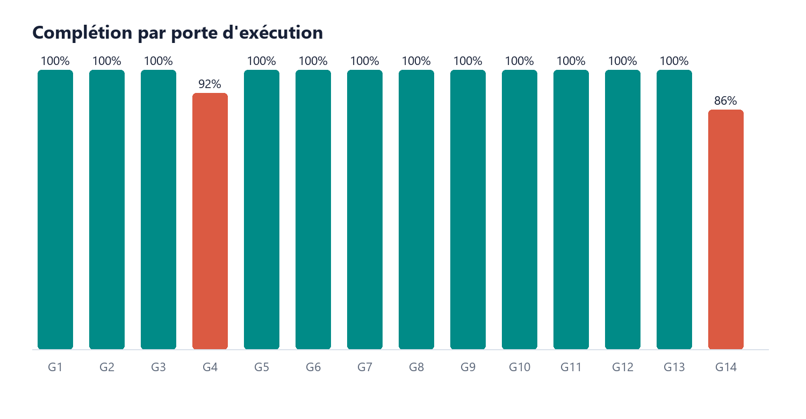

# Scholarium + Teach - Dossier maître de récupération

Date: 2026-07-16  
Statut: public pre-alpha; données synthétiques seulement  
Source de vérité: `docs/teach/EXECUTION_STATE.json`

## Résumé exécutif

- **161/163 actions sont terminées (98.77 %).**
- **Deux actions demeurent bloquées par des conditions externes:** 048 pour la validation Loi 25 et 157 pour l'authentification interactive du tunnel VS Code.
- **L'application est active:** landing, `/app`, `/teach`, santé API et leçon espagnole ont répondu HTTP 200.
- **La PR #2 est fusionnée:** https://github.com/SeCuReDmE-main-dev/securedme-scholarium/pull/2.
- **Le corpus G5 est fermé:** 125 cartes, 125 classifications Synthia, 125 paquets OpenIE et trois magasins de graphe durables.

Ce dossier permet de récupérer le projet sans relire la conversation. Il sépare l'idée initiale, les décisions, ce qui est réellement implanté, les preuves et ce qui demeure externe.

## 1. Point de départ: une vraie séance d'espagnol

Le projet est parti d'un besoin concret: apprendre à tenir une conversation quotidienne simple en espagnol au moyen de séances réelles d'environ une heure, pratiques, orales, visuelles, progressives et fondées sur la maîtrise.

Quatre interactions ont servi de premier laboratoire:

1. `Hola, ¿cómo estás?` -> `Muy bien, ¿y tú?`
2. `¿Cómo te llamas?` -> `Me llamo Jean-Sébastien.`
3. `¿De dónde eres?` -> `Soy de Montreal.`
4. `¿Cuántos años tienes?` -> `Tengo treinta y ocho años.`

Les erreurs observées ont établi les premiers contrats: une réponse doit correspondre à la question; une lecture ou un « OK » n'est pas une preuve de maîtrise; la phrase peut être segmentée puis reconstruite; les rappels doivent être immédiats, différés et contextuels; une séance doit reprendre exactement après interruption.

## 2. Idée centrale et invariants

**Un élève n'est pas résumé par ses notes.** Une note est un signal parmi d'autres. Scholarium Teach relie performance, processus d'apprentissage, talents, passions, projets, sport, musique, créativité, persévérance et contribution sociale.

L'exemple fondateur reste: `D en math -> réussite au soccer -> stratégie spatiale`. L'assistant peut proposer un pont entre lecture du jeu, angles, trajectoires, anticipation et géométrie. L'élève conserve le droit d'accepter, reformuler, contester, expirer ou supprimer cette interprétation.

Invariants conservés:

- empowerment, dignité et pluralité des formes d'intelligence;
- intégrité et respect plutôt qu'une conception restriction-first;
- expression honnête des difficultés sans positivité forcée;
- provenance, contradiction, incertitude et correction visibles;
- contrôle utilisateur et séparation des autorités;
- accessibilité edge-case-first;
- aucune surveillance cachée, écoute passive, décision disciplinaire autonome ou diagnostic clinique.

## 3. Évolution du système

### Mémoire pédagogique et maîtrise

Cours, modules, leçons, notions, questions, réponses, indices, niveaux d'aide, rappels et checkpoints forment une boucle durable. La maîtrise exige une réponse non assistée, liée à la bonne question, rappelée après délai et transférée dans un nouveau contexte.

### AlgoQuest et assistants

AlgoQuest sert de porte d'entrée éducative et d'outbox durable. L'assistant étudiant conserve le graphe privé. L'enseignant reçoit une projection pédagogique bornée; l'administration reçoit uniquement des agrégats respectant le seuil de cohorte.

### Accessibilité edge-case-first

Sept profils combinables ont été implantés: sourd/signé disponible, non verbal, Autism Calm, Tourette Safe, ADHD Sprint, Dyslexia Reading et Dyspraxia Motor. Les parcours essentiels fonctionnent sans voix, souris ou animation obligatoire.

### Social, portfolio et analytique

Le système comprend capsules de croissance, fils de projets, cercles, reconnaissances et récapitulatifs. Les statistiques sont utiles à l'élève et pratiques pour l'enseignant sans produire un score unique de valeur personnelle.

### Média et plugins éducatifs

Les médias sont déclenchés explicitement depuis une leçon, un fil, un projet ou une réussite. Les contrats plafonnent à trois vidéos quotidiennes de cinq minutes et cinq balados de trente minutes, avec confirmation distincte avant publication.

Six plugins éducatifs stateless possèdent des starters complets `AGENTS.md`, `SOUL.md` et `USER.md`. Aucun plugin ne possède de `MEMORY.md`; la mémoire est centralisée par le gateway.

### Synthia, MemoryLake et HippoRAG

Synthia préserve `I -> I_system^S -> H_lex -> G_lex -> I_lexicon`. MemoryLake fournit `index_records`; HippoRAG demeure limité à `retrieve_dpr`; Codex ou Gemini produit le langage utilisateur. Synthia trace les termes, sources, corrections et incertitudes sans devenir autorité pédagogique, scientifique, juridique ou taxonomique.

### FNP-QNN, FfeD, Gate5 et géométrie

Pluginpack a passé 337 tests, 41/41 contrôles d'intégrité et 12/12 contrôles doctor. FNP-QNN exécute cinq plugins sous allowlist et poids versionnés. Gate5 contrôle capacité, consentement, expiration, replay et preuve. La géométrie quasicristalline fournit adressage, projection, replay et diff; elle ne remplace pas la cryptographie et n'entre jamais dans KDF, AAD, coffre ou matériel de clé.

## 4. Ce qui a réellement été construit

- boucle espagnole complète avec checkpoint et scénario d'environ une heure;
- sept profils d'accessibilité, clavier, ARIA et contrôles de mouvement/son/densité;
- assistants, objectifs hebdomadaires, interventions silencieuses et miroir des forces;
- portfolio, projets, cercles, reconnaissances, récapitulatifs et tableaux analytiques;
- contrats QuaNTecH-ViD, quotas et manifestes signés contre altération et replay;
- six prefabs éducatifs avec starters Codex/Gemini et gateway mémoire central;
- corpus de 125 sources, Synthia, OpenIE et graphes approuvé/préparation/quarantaine;
- Gate5, FNP-QNN, pluginpack, Bouncy Castle transitoire et adressage structurel;
- identité Stitch, navigation Teach, Sources et Administration;
- guides élève/enseignant/administrateur, deux présentations et dossier corporatif;
- tests, captures, migrations, OpenAPI, sauvegarde/restauration, Datadog et déploiement Cloudflare.

## 5. État quantitatif des 163 actions

| Porte | Actions | Terminées | Bloquées | Total |
| --- | --- | --- | --- | --- |
| G1 | 001-012 | 12 | 0 | 12 |
| G2 | 013-024 | 12 | 0 | 12 |
| G3 | 025-036 | 12 | 0 | 12 |
| G4 | 037-048 | 11 | 1 | 12 |
| G5 | 049-060 | 12 | 0 | 12 |
| G6 | 061-072 | 12 | 0 | 12 |
| G7 | 073-084 | 12 | 0 | 12 |
| G8 | 085-096 | 12 | 0 | 12 |
| G9 | 097-108 | 12 | 0 | 12 |
| G10 | 109-120 | 12 | 0 | 12 |
| G11 | 121-132 | 12 | 0 | 12 |
| G12 | 133-144 | 12 | 0 | 12 |
| G13 | 145-156 | 12 | 0 | 12 |
| G14 | 157-163 | 6 | 1 | 7 |

La frontière d'exécution reste `156`. La dette historique 049-057 a été fermée sans rembobiner les groupes déjà validés.

## 6. État opérationnel vérifié

| Surface | HTTP | Octets | Contrôle |
| --- | --- | --- | --- |
| https://www.scholarium.securedme.ca/ | 200 | 28032 | Scholarium identity present |
| https://www.scholarium.securedme.ca/app | 200 | 20016 | Application shell present |
| https://www.scholarium.securedme.ca/teach | 200 | 15792 | Scholarium Teach present |
| https://www.scholarium.securedme.ca/api/health | 200 | 77 | Health response present |
| https://www.scholarium.securedme.ca/api/v1/teach/lesson | 200 | 3319 | Spanish lesson present |

- Branche de travail lors de la capture: `new/scholarium-teach-163-actions`.
- Commit de référence avant le dossier: `d3ee8156a59e850991399bef7c8fdb54c5e8ec2a`.
- PR #2: `MERGED`, fusionnée le `2026-07-16T05:37:07Z`.
- Check Datadog de la PR: `SUCCESS`.
- Le fichier utilisateur `assets/desing/ChatGPT Installer (1).exe` est exclu de la livraison Git.

## 7. Reprise exacte

Fichiers faisant autorité:

1. `docs/teach/EXECUTION_STATE.json` - pointeur de reprise.
2. `docs/teach/ACTION_MATRIX.csv` - statut et preuve de chaque action.
3. `docs/teach/EVIDENCE_REGISTER.md` - index des preuves.
4. `docs/teach/IDEA_REGISTRY.md` - idées conservées, reportées ou rejetées.
5. `docs/teach/corpus/classification-run.json` - reçu G5.

Procédure après reboot:

1. Lire `activeAction` dans `EXECUTION_STATE.json`; ne jamais choisir la plus ancienne ligne incomplète de la matrice.
2. Vérifier `git status --short` et préserver tous les fichiers utilisateur non suivis.
3. Lancer les tests ciblés de l'action active.
4. Consigner une preuve directe avant de modifier un statut.
5. Ne jamais faire reculer `executionFrontier` pour régler une dette historique.

Blocages restant à fermer:

- **048:** obtenir une revue Loi 25 qualifiée avant toute donnée réelle d'élève; conserver la porte France/UE séparée.
- **157:** terminer l'authentification interactive du tunnel VS Code; le développement local reste fonctionnel.

## 8. Corpus G5 et limites explicites

- 125 cartes uniques et 125 classifications Synthia réelles.
- 66 URL accessibles, 54 restreintes, 2 erreurs HTTP et 3 vérifications réseau non résolues.
- 125 paquets OpenIE; aucune contradiction sémantique inventée.
- `approved=0`, `preparation=125`, `quarantine=0`.
- Les graphes sont opérationnels; leur partition ne constitue jamais une certification.

## 9. Index des livrables

- `docs/teach/deliverables/Scholarium_Teach_Corporate_Dossier.pdf`
- `docs/teach/deliverables/guides/Scholarium_Teach_Administrator_Guide.docx`
- `docs/teach/deliverables/guides/Scholarium_Teach_Student_Guide.docx`
- `docs/teach/deliverables/guides/Scholarium_Teach_Teacher_Guide.docx`
- `docs/teach/deliverables/presentations/Scholarium_Teach_Operating_Review.pptx`
- `docs/teach/deliverables/presentations/Scholarium_Teach_Operating_Review.pptx.inspect.ndjson`
- `docs/teach/deliverables/presentations/Scholarium_Teach_Team_Alignment.pptx`
- `docs/teach/deliverables/presentations/Scholarium_Teach_Team_Alignment.pptx.inspect.ndjson`

## Annexe A - Registre complet des idées

| Idée | Source | Classe | Décision | Destination |
| --- | --- | --- | --- | --- |
| One-hour conversational Spanish lessons | Original learning session | requirement | implemented | `/teach`, lesson contract |
| Mastery requires unaided, contextual, delayed, restart, and transfer evidence | Original learning session | invariant | implemented | `teach-contracts.ts` |
| Exact pause and resume | Original learning session | requirement | implemented | local checkpoint and D1 checkpoint |
| Voice, transcript, translation, and phonetic support | Original learning session | requirement | partially implemented | browser speech and visual lesson; live transcription remains gated |
| AlgoQuest as the education entry point | Original design report | architecture | accepted | durable event outbox |
| Student and teacher assistants exchange bounded summaries | Original design report | architecture | accepted | Gate5 exchange contract |
| Assistant follows the real school year | Brainstorm | requirement | accepted | weekly objectives domain |
| Daily learning guidance without fatigue | Brainstorm | requirement | accepted | intervention preferences; no hidden phone surveillance |
| Recognize academic, spatial, athletic, musical, artistic, and social strengths | Brainstorm | invariant | implemented foundation | contestable strength observations |
| Math difficulty connected to soccer spatial strategy | Brainstorm recovery | example | implemented | strength bridge |
| Honest frustration can become a growth story | Brainstorm recovery | social behavior | accepted | `growth_story` contract |
| Integrity and respect contracts instead of restriction-first design | Brainstorm correction | invariant | accepted | social integrity policy |
| Edge-case-first support | Brainstorm | invariant | implemented foundation | Teach access controls and QA gate |
| Deaf and signed learning | Brainstorm | requirement | research-gated | signed assets and qualified review required |
| Non-verbal and assistive communication | Brainstorm | requirement | accepted | multimodal response contract |
| Autism, Tourette, ADHD, dyslexia, and dyspraxia modes | Brainstorm | requirement | implemented foundation | local accessibility profiles |
| Student-friendly and teacher-practical analytics | Brainstorm | requirement | implemented foundation | learner and teacher Teach views |
| Five social patterns for education | Brainstorm | product direction | accepted | growth stories, project threads, circles, recognition, recaps |
| Three user-triggered videos per day, maximum five minutes | Brainstorm | quota | implemented contract | Teach media API |
| Five user-triggered podcasts per day, maximum thirty minutes | Brainstorm | quota | implemented contract | Teach media API |
| Media generated from a selected lesson, thread, project, or success | Brainstorm | invariant | implemented contract | source-bound media request |
| 125-source educational corpus | Brainstorm | research deliverable | research-gated | Synthia source registry |
| Synthia classification and HippoRAG retrieval | Brainstorm | integration | accepted | adapter boundary |
| MemoryLake as approved durable evidence store | Brainstorm | integration | accepted | `MemoryLake.index_records` boundary |
| Plithogenic handling of compatible, contradictory, uncertain, evolving signals | Brainstorm | algorithm research | accepted | FNP-QNN adapter research lane |
| FNP-QNN five-plugin integration | Existing implementation | integration | accepted after integrity repair | Gate5 to FNP-QNN |
| Import all pluginpack plugins into Scholarium | Repo audit | architecture | rejected | selected capabilities only through Gate5 |
| FfeD as capability, proof, replay, and audit broker | Repo audit | architecture | accepted | internal gateway |
| Quasicrystal geometry as the sole cryptographic protection | Repo audit | security claim | rejected | geometry remains structural proof and addressing |
| Quasicrystal partitioning, projection, replay, and diff | Repo audit | experimental capability | accepted, non-blocking | FfeD sidecar |
| Codex/OpenAI and Antigravity/Gemini browser authentication | School governance | invariant | accepted | existing WebAuth boundary |
| Unknown or raw-token classroom providers | School governance | provider route | rejected | unsupported school route |
| Law 25 and EFVP before real student data | Brainstorm and official law | launch gate | accepted | EFVP dossier |
| Datadog for reliability without personal content | Brainstorm | operations | accepted | gateway metrics only |
| VS Code tunnel | Brainstorm | operations | accepted | authenticated, bounded port surface |
| cPanel deployment | Brainstorm | operations | partially accepted | static, domain, docs, and compatible proxy only |
| Forty-prompt Life Science learning book | Brainstorm | publication | accepted | professional publication lane |
| Six education plugins with complete Codex and Gemini starter prompts | Live implementation clarification | plugin contract | implemented and validated | actions 117-120 plugin prefabs |
| No intra-plugin MEMORY.md | Live implementation clarification | architecture invariant | implemented and validated | central knowledge gateway only |
| HippoRAG central graph classification and Hilbert location vectors | Live implementation clarification | experimental integration | implemented contract, runtime pending | central gateway adapter |
| Euler graph matrices and replayable vector production | Live implementation clarification | computational contract | implemented contract, runtime pending | adjacency, incidence, degree and Laplacian outputs |
| Existing Scholarium assets must replace the starter-template identity | Live implementation clarification | visual product requirement | accepted | actions 133, 137-139 and `VISUAL_IDENTITY_EXECUTION_BRIEF.md` |
| V.O.T Guardian Tenebris as an ephemeral processing envelope | Live implementation clarification and local repo audit | security integration | accepted, research-gated | actions 130+, Gate5 private adapter and `VOT_GUARDIAN_TENEBRIS_INTEGRATION_ASSESSMENT.md` |
| Direct V.O.T voice detector import or automatic student voice analysis | Local repo audit | unsafe coupling | rejected | no direct import; no passive listening or biometric route |
| Military use | Brainstorm detour | excluded scope | rejected | no destination |

## Annexe B - Registre complet des 163 actions

| ID | Porte | Action | Skills | Plugins | Statut | Preuve |
| --- | --- | --- | --- | --- | --- | --- |
| 001 | G1 | Capturer chaque idée du chat, du rapport espagnol et des fichiers locaux dans un registre unique. | S1,S6 | P0,P2 | completed | See docs/teach/EVIDENCE_REGISTER.md |
| 002 | G1 | Attribuer à chaque idée un identifiant stable, sa source, son intention et sa formulation originale. | S3,S6 | P0,P2 | completed | See docs/teach/EVIDENCE_REGISTER.md |
| 003 | G1 | Classer chaque idée comme exigence, hypothèse, recherche, décision, risque ou vision future. | S1,S6 | P0,P2 | completed | See docs/teach/EVIDENCE_REGISTER.md |
| 004 | G1 | Créer la matrice `idée -> lot -> contrat -> test -> preuve -> statut`. | S1,S3 | P0,P1 | completed | See docs/teach/EVIDENCE_REGISTER.md |
| 005 | G1 | Enregistrer explicitement les idées conservées, reportées, remplacées ou rejetées avec justification. | S1,S4 | P0 | completed | See docs/teach/EVIDENCE_REGISTER.md |
| 006 | G1 | Fixer les invariants Scholarium : empowerment, dignité, pluralité des forces, provenance et contrôle utilisateur. | S1,S2 | P1 | completed | See docs/teach/EVIDENCE_REGISTER.md |
| 007 | G1 | Fixer les frontières d’autorité de Codex, Gemini, Synthia, QuaNthoR et des moteurs algorithmiques. | S2,S6 | P1,P2 | completed | See docs/teach/EVIDENCE_REGISTER.md |
| 008 | G1 | Documenter AlgoQuest comme porte d’entrée éducative, Scholarium comme plateforme sociale et Teach comme domaine adaptatif. | S1,S2 | P1 | completed | See docs/teach/EVIDENCE_REGISTER.md |
| 009 | G1 | Documenter l’exclusion des usages militaires, disciplinaires autonomes, cliniques et de surveillance cachée. | S2,S4 | P1 | completed | See docs/teach/EVIDENCE_REGISTER.md |
| 010 | G1 | Créer le registre des décisions d’architecture avec contexte, alternatives et conséquences. | S2,S3 | P0 | completed | See docs/teach/EVIDENCE_REGISTER.md |
| 011 | G1 | Créer le registre des risques techniques, pédagogiques, juridiques, sociaux et opérationnels. | S4 | P0,P1 | completed | See docs/teach/EVIDENCE_REGISTER.md |
| 012 | G1 | Construire le tableau maître des 163 actions avec dépendances, preuves et portes de sortie. | S1 | P0,P12 | completed | See docs/teach/EVIDENCE_REGISTER.md |
| 013 | G2 | Photographier l’état Git de Scholarium, FfeD, pluginpack, FNP-QNN, Synthia, HippoRAG et QuaNTecH-ViD. | S2,S4 | P0,P13 | completed | See docs/teach/EVIDENCE_REGISTER.md |
| 014 | G2 | Identifier et préserver toutes les modifications et tous les fichiers non suivis appartenant à l’utilisateur. | S2 | P0,P12 | completed | See docs/teach/EVIDENCE_REGISTER.md |
| 015 | G2 | Inventorier les applications, API, schémas, migrations, tests et documents déjà présents dans Scholarium. | S1,S5 | P0,P4 | completed | See docs/teach/EVIDENCE_REGISTER.md |
| 016 | G2 | Inventorier les plugins, skills, MCP, connecteurs et commandes réellement disponibles. | S1,S5 | P0,P4 | completed | See docs/teach/EVIDENCE_REGISTER.md |
| 017 | G2 | Vérifier l’environnement Node, npm, Wrangler, Python et la `.venv` centrale. | S4,S12 | P0,P5 | completed | See docs/teach/EVIDENCE_REGISTER.md |
| 018 | G2 | Vérifier l’existence et les noms des variables `.env` sans lire ni afficher leurs valeurs. | S4,S12 | P0,P5 | completed | See docs/teach/EVIDENCE_REGISTER.md |
| 019 | G2 | Exécuter les builds, tests et lint actuels de Scholarium afin d’établir la référence initiale. | S4 | P0 | completed | Build passed; 107/107 tests passed; lint 0 errors and 20 known warnings |
| 020 | G2 | Exporter la référence OpenAPI actuelle et détecter les routes de compatibilité. | S3 | P0 | completed | Runtime OpenAPI 3.1.0 returned HTTP 200 with 82 paths; compatibility routes retained |
| 021 | G2 | Exécuter le doctor complet de pluginpack et consigner ses sept défaillances connues. | S4 | P13 | completed | Pluginpack 337 passed; integrity 41/41; doctor 12/12 PASS |
| 022 | G2 | Revalider le bridge FNP-QNN et l’exécution réelle de ses cinq plugins. | S3,S4 | P13 | completed | Five live plugins observed; no errors; module state restored |
| 023 | G2 | Revalider Gate5, les contrats, preuves, replay et tests de FfeD. | S2,S4 | P13 | completed | G11 Gate5 tamper replay expiry revocation recovery concurrency and interop evidence passed |
| 024 | G2 | Vérifier la santé de Synthia, MemoryLake, HippoRAG et QuaNTecH-ViD sans modifier leurs dépôts. | S5,S6 | P2,P3,P7,P13 | completed | Synthia 265; MemoryLake 49; retrieval boundary 20; QuaNTecH 9 and adapter 2 passed |
| 025 | G3 | Produire la carte complète des composants et des flux de données. | S2 | P0,P9 | completed | Architecture and five validated diagram packages delivered in docs/teach/diagrams |
| 026 | G3 | Définir Scholarium Teach comme domaine du dépôt existant et non comme seconde application indépendante. | S1,S2 | P1 | completed | Teach routes schema and UI compile inside apps/web; no second identity application |
| 027 | G3 | Définir la passerelle interne entre Cloudflare, FfeD et les workers Python. | S2,S3 | P13 | completed | Versioned Gate5 outbox and private-worker separation validated in G11 and G14 |
| 028 | G3 | Établir que Scholarium n’importe directement ni pluginpack, ni le noyau FfeD, ni HippoRAG. | S2 | P13 | completed | Static bundle-boundary test passed; Gate5 outbox imports no external runtime |
| 029 | G3 | Spécifier `scholarium.learning-objective.v1`. | S3 | P1 | completed | Teach schema API and contract tests validated learning objectives |
| 030 | G3 | Spécifier `scholarium.learning-attempt.v1` et les niveaux d’aide. | S3 | P1 | completed | Spanish loop validated six help levels and question-bound attempts |
| 031 | G3 | Spécifier `scholarium.mastery-evidence.v1` et ses preuves minimales. | S3 | P1 | completed | G6 evidence proved recall context and transfer requirements |
| 032 | G3 | Spécifier `scholarium.strength-observation.v1` avec contexte, contradiction et expiration. | S3,S6 | P1,P2 | completed | G8 tests validated provenance contradiction confidence expiry and learner controls |
| 033 | G3 | Spécifier `scholarium.growth-story.v1` pour les réussites multidimensionnelles. | S3 | P1 | completed | G9 durable growth_story publication contract and tests passed |
| 034 | G3 | Spécifier les contrats RAG, source card, requête, résultat et lien de mémoire. | S3,S6 | P2,P3 | completed | Central gateway contract and route compile; graph contract tests pass |
| 035 | G3 | Spécifier les contrats de signal FNP-QNN, porteur, capacité Gate5 et preuve géométrique. | S3 | P13 | completed | Live FNP carrier, Gate5 registry and quasicrystal structural-address contracts validated |
| 036 | G3 | Définir la politique de versionnement, dépréciation, migration, idempotence et erreurs. | S3,S4 | P0 | completed | Versioned schemas idempotency receipts migrations and API error tests passed |
| 037 | G4 | Réutiliser l’identité existante sans créer une seconde base d’utilisateurs Teach. | S2,S3 | P1 | completed | Teach uses the existing authenticated user and account tables |
| 038 | G4 | Étendre les rôles élève, enseignant, gardien, administrateur, école et commission. | S3 | P1 | completed | Role and tenant boundaries validated in G13 |
| 039 | G4 | Définir les liens élève-enseignant-classe-école avec dates et révocation. | S3 | P1 | completed | Education relationships and scoped assignments validated in schema and API tests |
| 040 | G4 | Créer les consentements séparés pour apprentissage, personnalisation, profilage, partage et média. | S3,S4 | P1 | completed | Purpose-specific Teach consents and media publication confirmation validated |
| 041 | G4 | Ajouter les règles adaptées aux moins de 14 ans et aux responsabilités du gardien. | S4 | P1 | completed | Minor capability and guardian activation revocation expiry routes validated |
| 042 | G4 | Définir les durées de conservation par type de donnée et finalité. | S3,S4 | P1 | completed | Retention schedule documented in EFVP and backup recovery runbook |
| 043 | G4 | Implémenter accès, correction, exportation, retrait et effacement de Teach. | S3,S4 | P1 | completed | Export consent revocation and Teach-domain deletion tests passed |
| 044 | G4 | Concevoir l’EFVP Scholarium Teach avant toute utilisation de données réelles. | S4 | P1,P10 | completed | docs/teach/PRIVACY_EFVP.md delivered; synthetic-data gate remains enforced |
| 045 | G4 | Séparer données brutes, observations, inférences, recommandations et décisions humaines. | S2,S3,S6 | P1,P2 | completed | Architecture contracts and G8 projections preserve the five data classes |
| 046 | G4 | Définir l’accès exceptionnel doublement autorisé, temporaire, justifié et audité. | S3,S4 | P1,P13 | completed | Two independent approvers; four-hour maximum; single-use claim; digest audit; 4 tests and 35-migration rehearsal passed |
| 047 | G4 | Empêcher la reconstruction des personnes à partir des métriques agrégées. | S4,S8 | P1,P6 | completed | Minimum cohort 10 suppression and identifier-free organization projections passed |
| 048 | G4 | Faire valider le dossier Loi 25 avant le pilote réel et créer une porte juridique France/UE distincte. | S4 | P1,P10 | blocked | External qualified legal review is required before a real-student pilot; synthetic data only |
| 049 | G5 | Définir les catégories nécessaires au corpus de 125 sources. | S1,S5,S6 | P2,P4 | completed | Eight bounded categories total exactly 125 targets; see MISSION_049_057_EDUCATION_CORPUS.md |
| 050 | G5 | Collecter les sources primaires sur pédagogie, maîtrise, accessibilité et neurodiversité. | S5 | P4 | completed | 65 primary-source candidates retained with Crossref or issuing-authority provenance |
| 051 | G5 | Collecter les sources primaires sur forces, talents, motivation et apprentissage contextualisé. | S5 | P4 | completed | 45 primary-source candidates retained across strengths, belonging, sport, music and creativity |
| 052 | G5 | Collecter les sources juridiques et institutionnelles Québec, Canada, France et UE. | S5,S4 | P4 | completed | 15 official primary documents retained with jurisdiction and issuing-authority URLs |
| 053 | G5 | Vérifier auteurs, URL, licence, date, citation et droits de chaque source. | S5,S6 | P2,P4 | completed | 125/125 metadata and rights fields checked; 120 URLs reachable or access-restricted; 5 unresolved checks retained visibly |
| 054 | G5 | Produire les 125 cartes `synthia.education.source-card.v1`. | S3,S6 | P2 | completed | 125 unique source cards; SHA-256 B246B8F061A7D6B3D09EAD3329DA4EBECA8EABF66258FFEC873BC7537C392000 |
| 055 | G5 | Classifier les concepts dans `H_lex`, `G_lex` et `I_lexicon` sans autorité taxonomique autonome. | S6 | P2 | completed | 125 real Synthia CLI classifications preserve I -> I_system^S -> H_lex -> G_lex -> I_lexicon |
| 056 | G5 | Extraire entités, relations, contradictions et paquets OpenIE traçables. | S6 | P2 | completed | 125 source-bound OpenIE packets; unresolved layers explicit; no semantic contradiction invented |
| 057 | G5 | Créer les graphes séparés approuvé, préparation et quarantaine. | S2,S3 | P2,P13 | completed | Three durable partition manifests and eight preparation shards; approved 0, preparation 125, quarantine 0 |
| 058 | G5 | Implémenter `MemoryLakeHippoRAGTraceStore` via `MemoryLake.index_records`. | S3,S6 | P2,P3,P13 | completed | Synthia unit tests 8/8; real isolated MemoryLake indexed 2, deduped 2 on replay, retrieval count 1 |
| 059 | G5 | Configurer HippoRAG en récupération seule et garder la génération dans Codex ou Gemini. | S2,S4 | P1,P13 | completed | Synthia gateway calls retrieve_dpr only; generation and graph fact reranking bypassed; generative methods fail closed |
| 060 | G5 | Mesurer précision, rappel, provenance, suppression et reconstruction face à MemoryLake seul. | S4,S8 | P3,P6,P13 | completed | Synthetic benchmark: MemoryLake P@3 0.333333 R@3 0.833333; DPR-compatible P@3 0.388889 R@3 1.0; both provenance 1.0, leakage 0.0, reconstruction 1.0; JSON SHA-256 2D4CCD1B4A7F4EA001F92BB21D1EBEC435988A18FEF49B963DD7F2C12E3A1F54 |
| 061 | G6 | Modéliser cours, module, leçon, notion, question, réponse, indice et rappel. | S2,S3 | P1 | completed | See docs/teach/MISSION_061_072_SPANISH_SESSION.md |
| 062 | G6 | Encoder les quatre interactions espagnoles issues de la séance originale. | S3 | P1 | completed | See docs/teach/MISSION_061_072_SPANISH_SESSION.md |
| 063 | G6 | Créer les états `nouvelle`, `guidée`, `rappelée`, `contextualisée`, `maîtrisée` et `à revoir`. | S3 | P1 | completed | See docs/teach/MISSION_061_072_SPANISH_SESSION.md |
| 064 | G6 | Implémenter la vérification réponse-question pour éviter les réponses mémorisées hors contexte. | S3,S4 | P1 | completed | See docs/teach/MISSION_061_072_SPANISH_SESSION.md |
| 065 | G6 | Implémenter le découpage progressif d’une phrase et sa reconstruction complète. | S3 | P1 | completed | See docs/teach/MISSION_061_072_SPANISH_SESSION.md |
| 066 | G6 | Implémenter l’échelle d’aide : attente, indice, premier segment, segmentation et modèle complet. | S3 | P1 | completed | See docs/teach/MISSION_061_072_SPANISH_SESSION.md |
| 067 | G6 | Implémenter les rappels immédiats, différés et espacés. | S3,S5 | P1,P4 | completed | See docs/teach/MISSION_061_072_SPANISH_SESSION.md |
| 068 | G6 | Enregistrer erreurs fréquentes, confusions, aide requise, délai et transfert contextuel. | S3,S8 | P1,P6 | completed | See docs/teach/MISSION_061_072_SPANISH_SESSION.md |
| 069 | G6 | Empêcher qu’une lecture, une répétition ou un « OK » soit compté comme maîtrise. | S3,S4 | P1 | completed | See docs/teach/MISSION_061_072_SPANISH_SESSION.md |
| 070 | G6 | Construire la reprise exacte après pause ou fermeture de séance. | S2,S3 | P1 | completed | See docs/teach/MISSION_061_072_SPANISH_SESSION.md |
| 071 | G6 | Produire le résumé enseignant de la séance sans transcription privée brute. | S3,S4 | P1 | completed | See docs/teach/MISSION_061_072_SPANISH_SESSION.md |
| 072 | G6 | Valider une séance complète d’environ une heure avec rappels et conversation finale. | S4,S9 | P1,P9 | completed | See docs/teach/MISSION_061_072_SPANISH_SESSION.md |
| 073 | G7 | Auditer les modes d’accessibilité existants et leur persistance locale. | S4,S7,S9 | P1,P9 | completed | See docs/teach/MISSION_073_084_ACCESSIBILITY.md |
| 074 | G7 | Concevoir le mode sourd/signé avec transcription, visuels et contenus signés disponibles. | S5,S7 | P4,P9 | completed | See docs/teach/MISSION_073_084_ACCESSIBILITY.md |
| 075 | G7 | Concevoir le mode non verbal avec texte, choix, pictogrammes et communication assistée. | S5,S7 | P4,P9 | completed | See docs/teach/MISSION_073_084_ACCESSIBILITY.md |
| 076 | G7 | Concevoir Autism Calm avec prévisibilité, faible surprise et séquences visibles. | S5,S7 | P4,P9 | completed | See docs/teach/MISSION_073_084_ACCESSIBILITY.md |
| 077 | G7 | Concevoir Tourette Safe sans pénalité pour délai, tic, mouvement ou vocalisation. | S5,S7 | P4,P9 | completed | See docs/teach/MISSION_073_084_ACCESSIBILITY.md |
| 078 | G7 | Concevoir ADHD Sprint avec objectif court, minuteur et prochain geste visible. | S5,S7 | P4,P9 | completed | See docs/teach/MISSION_073_084_ACCESSIBILITY.md |
| 079 | G7 | Concevoir Dyslexia Reading avec typographie, largeur, espacement et lecture audio ajustables. | S5,S7 | P4,P9 | completed | See docs/teach/MISSION_073_084_ACCESSIBILITY.md |
| 080 | G7 | Concevoir Dyspraxia Motor avec grandes cibles et absence d’interactions exigeant une précision fine. | S5,S7 | P4,P9 | completed | See docs/teach/MISSION_073_084_ACCESSIBILITY.md |
| 081 | G7 | Ajouter contrôles de mouvement, contraste, saturation, densité, son et vitesse. | S7 | P9 | completed | See docs/teach/MISSION_073_084_ACCESSIBILITY.md |
| 082 | G7 | Garantir clavier, lecteur d’écran, annonces ARIA et ordre de focus cohérent. | S7,S9 | P9 | completed | See docs/teach/MISSION_073_084_ACCESSIBILITY.md |
| 083 | G7 | Tester mobile, tablette, desktop, faible bande passante et reprise hors ligne limitée. | S4,S9 | P9 | completed | See docs/teach/MISSION_073_084_ACCESSIBILITY.md |
| 084 | G7 | Faire de l’accessibilité un contrat testé dans CI et non une option décorative. | S3,S9 | P9,P12 | completed | See docs/teach/MISSION_073_084_ACCESSIBILITY.md |
| 085 | G8 | Remplacer le stub AlgoQuest par une outbox durable, versionnée et idempotente. | S2,S3 | P1 | completed | See docs/teach/MISSION_085_096_ASSISTANTS_STRENGTHS.md |
| 086 | G8 | Créer l’assistant privé de l’élève et son graphe personnel. | S2,S3 | P1,P3 | completed | See docs/teach/MISSION_085_096_ASSISTANTS_STRENGTHS.md |
| 087 | G8 | Créer l’assistant enseignant avec sorties pédagogiques bornées. | S2,S3 | P1 | completed | See docs/teach/MISSION_085_096_ASSISTANTS_STRENGTHS.md |
| 088 | G8 | Créer les assistants administratifs uniquement pour les agrégats autorisés. | S2,S4 | P1 | completed | See docs/teach/MISSION_085_096_ASSISTANTS_STRENGTHS.md |
| 089 | G8 | Définir le protocole assistant-à-assistant avec finalité, expiration et reçu. | S3 | P1,P13 | completed | See docs/teach/MISSION_085_096_ASSISTANTS_STRENGTHS.md |
| 090 | G8 | Construire les objectifs hebdomadaires reliés à l’année scolaire réelle. | S3 | P1 | completed | See docs/teach/MISSION_085_096_ASSISTANTS_STRENGTHS.md |
| 091 | G8 | Ajouter les préférences d’intervention quotidienne, fréquence, contexte et silence. | S3,S4 | P1 | completed | See docs/teach/MISSION_085_096_ASSISTANTS_STRENGTHS.md |
| 092 | G8 | Créer les observations de forces déclarées, observées et proposées. | S3,S6 | P1,P2 | completed | See docs/teach/MISSION_085_096_ASSISTANTS_STRENGTHS.md |
| 093 | G8 | Conserver preuve, contradiction, confiance, ancienneté et correction de chaque force proposée. | S3,S6 | P1,P2 | completed | See docs/teach/MISSION_085_096_ASSISTANTS_STRENGTHS.md |
| 094 | G8 | Implémenter le pont `D en math -> réussite au soccer -> stratégie spatiale`. | S1,S6 | P1,P2 | completed | See docs/teach/MISSION_085_096_ASSISTANTS_STRENGTHS.md |
| 095 | G8 | Permettre à l’élève d’accepter, reformuler, contester, expirer ou supprimer une interprétation. | S3,S4 | P1 | completed | See docs/teach/MISSION_085_096_ASSISTANTS_STRENGTHS.md |
| 096 | G8 | Tester que l’assistant encourage sans diagnostic, flatterie automatique ou positivité forcée. | S4,S6 | P1,P2 | completed | See docs/teach/MISSION_085_096_ASSISTANTS_STRENGTHS.md |
| 097 | G9 | Étendre les publications avec le type `growth_story`. | S2,S3 | P1 | completed | See docs/teach/MISSION_097_108_SOCIAL_ANALYTICS.md |
| 098 | G9 | Construire les capsules de réussite courtes avec preuve, contexte et réflexion. | S7 | P1,P9 | completed | See docs/teach/MISSION_097_108_SOCIAL_ANALYTICS.md |
| 099 | G9 | Construire les fils de projets avec jalons, versions, fichiers, sources et contributions. | S2,S3,S7 | P1,P9 | completed | See docs/teach/MISSION_097_108_SOCIAL_ANALYTICS.md |
| 100 | G9 | Construire les cercles de classe, équipe, musique, art, intérêt et entraide. | S2,S3,S7 | P1,P9 | completed | See docs/teach/MISSION_097_108_SOCIAL_ANALYTICS.md |
| 101 | G9 | Ajouter les reconnaissances persévérance, créativité, leadership, entraide, clarté et progrès. | S3,S7 | P1,P9 | completed | See docs/teach/MISSION_097_108_SOCIAL_ANALYTICS.md |
| 102 | G9 | Construire les récapitulatifs hebdomadaires, mensuels et trimestriels. | S7,S8 | P1,P6,P9 | completed | See docs/teach/MISSION_097_108_SOCIAL_ANALYTICS.md |
| 103 | G9 | Autoriser l’expression honnête d’une difficulté et proposer une reformulation facultative. | S3,S6 | P1,P2 | completed | See docs/teach/MISSION_097_108_SOCIAL_ANALYTICS.md |
| 104 | G9 | Implémenter le contrat d’intégrité contre harcèlement, usurpation, doxxing et preuve falsifiée. | S3,S4 | P1 | completed | See docs/teach/MISSION_097_108_SOCIAL_ANALYTICS.md |
| 105 | G9 | Concevoir des comparaisons multidimensionnelles explicables sans résumer une personne à une note. | S1,S8 | P1,P6 | completed | See docs/teach/MISSION_097_108_SOCIAL_ANALYTICS.md |
| 106 | G9 | Construire le tableau élève avec notions, rappels, forces, projets et preuves. | S7,S8 | P6,P9 | completed | See docs/teach/MISSION_097_108_SOCIAL_ANALYTICS.md |
| 107 | G9 | Construire le tableau enseignant avec objectifs, confusions, stratégies et interventions. | S7,S8 | P1,P6,P9 | completed | See docs/teach/MISSION_097_108_SOCIAL_ANALYTICS.md |
| 108 | G9 | Construire les vues école et commission avec seuils d’agrégation et prévention de reconstruction. | S4,S8 | P1,P6 | completed | See docs/teach/MISSION_097_108_SOCIAL_ANALYTICS.md |
| 109 | G10 | Étendre le contrat média pour les leçons, fils, projets et réussites. | S3 | P7 | completed | docs/teach/evidence/mission-109-120-media-plugins.json |
| 110 | G10 | Implémenter le quota de trois vidéos quotidiennes de cinq minutes. | S3,S4 | P7 | completed | docs/teach/evidence/mission-109-120-media-plugins.json |
| 111 | G10 | Implémenter le quota de cinq balados quotidiens de trente minutes. | S3,S4 | P7 | completed | docs/teach/evidence/mission-109-120-media-plugins.json |
| 112 | G10 | Adapter automatiquement les quotas aux limites gratuites réelles du moteur. | S4,S5 | P4,P7 | completed | docs/teach/evidence/mission-109-120-media-plugins.json |
| 113 | G10 | Exiger un déclenchement explicite par l’utilisateur pour chaque génération. | S3,S4 | P7 | completed | docs/teach/evidence/mission-109-120-media-plugins.json |
| 114 | G10 | Construire le script depuis la source sélectionnée, ses preuves et son contexte. | S3,S6 | P2,P7 | completed | docs/teach/evidence/mission-109-120-media-plugins.json |
| 115 | G10 | Connecter le worker local QuaNTecH-ViD avec manifestes signés et expirants. | S2,S3 | P7,P13 | completed | docs/teach/evidence/mission-109-120-media-plugins.json |
| 116 | G10 | Exiger une confirmation distincte avant toute publication externe. | S3,S4 | P7 | completed | docs/teach/evidence/mission-109-120-media-plugins.json |
| 117 | G10 | Définir le manifeste standard des plugins éducatifs Gate5. | S3,S11 | P1,P13 | completed | docs/teach/evidence/mission-109-120-media-plugins.json |
| 118 | G10 | Créer les premiers prefabs pour leçon, rappel, accessibilité, source, portfolio et rapport. | S1,S11 | P1 | completed | docs/teach/evidence/mission-109-120-media-plugins.json |
| 119 | G10 | Router automatiquement les recherches Life Science vers le bon outil spécialisé. | S5,S11 | P4,P8 | completed | docs/teach/evidence/mission-109-120-media-plugins.json |
| 120 | G10 | Produire le livre de quarante prompts formatifs Life Science pour élèves et enseignants. | S5,S10 | P8,P10 | completed | docs/teach/evidence/mission-109-120-media-plugins.json |
| 121 | G11 | Corriger l’empreinte SHA-256 du manifeste `p046` à partir du contenu validé. | S3,S4 | P13 | completed | Integrity verifier reports 41/41 valid |
| 122 | G11 | Corriger les six autres échecs de la suite pluginpack. | S4 | P13 | completed | Pluginpack full suite 337 passed |
| 123 | G11 | Obtenir un doctor pluginpack à 41/41 et zéro échec de test. | S4 | P13 | completed | Doctor 12/12 PASS; 337 tests passed |
| 124 | G11 | Ajouter la validation d’intégrité avant toute invocation depuis FNP-QNN. | S2,S3,S4 | P13 | completed | Fail-closed altered-plugin test and real bridge run |
| 125 | G11 | Isoler le chargement dynamique pour éviter les collisions `sys.path` et `sys.modules`. | S2,S4 | P13 | completed | Locked loader restores sys.path and sys.modules; targeted tests passed |
| 126 | G11 | Centraliser l’allowlist et les poids des cinq plugins dans un contrat versionné. | S2,S3 | P13 | completed | fnp-qnn.ffed-plugin-policy.v1 validated with five live plugins |
| 127 | G11 | Revalider les porteurs `D_f`, `dF`, `i_fractal`, traces et configurations effectives. | S3,S6 | P2,P13 | completed | Live five-plugin run preserved carrier hierarchy and effective configurations |
| 128 | G11 | Exposer FNP-QNN uniquement derrière Gate5 avec paquets pseudonymisés. | S2,S3 | P13 | completed | Signed keyed-pseudonym Gate5 envelope rejects raw identity and content |
| 129 | G11 | Connecter Gate5 aux adaptateurs Synthia, mémoire, HippoRAG, FNP et média. | S2,S3 | P2,P3,P7,P13 | completed | Versioned registry plus durable outbox covers five active private adapters |
| 130 | G11 | Implémenter l’adressage déterministe des cellules quasicristallines et les empreintes de projection. | S2,S3 | P13 | completed | Deterministic fivefold structural cell and projection fingerprint tests passed |
| 131 | G11 | Maintenir les valeurs géométriques hors KDF, AAD, coffre et matériel de clé. | S2,S4 | P13 | completed | Geometry cryptographic-use prohibition and bundle-boundary tests passed |
| 132 | G11 | Tester menace, altération, replay, diff, révocation, récupération, concurrence et performance. | S4 | P13 | completed | 13/13 targeted threat tests plus BC/WebCrypto interoperability passed |
| 133 | G12 | Transformer la navigation actuelle selon le sitemap Signal, Teach, AlgoQuest, Cours, Projets, Cercles, Studio et Statistiques. | S1,S7 | P9 | completed | Validated sitemap in app shell and desktop capture; 98/98 tests |
| 134 | G12 | Construire la vue Teach élève comme écran principal utilisable. | S7 | P1,P9 | completed | Teach learner path validated on desktop, tablet and mobile |
| 135 | G12 | Construire la vue Teach enseignant dense et orientée vers les tâches. | S7,S8 | P1,P6,P9 | completed | Teacher projection and task-oriented Teach surface validated |
| 136 | G12 | Construire les vues Sources, Administration et gestion des consentements. | S7 | P1,P9 | completed | Sources and Administration panels compile and render without console errors |
| 137 | G12 | Revoir le système visuel Scholarium sans casser l’identité publique existante. | S7,S9 | P9 | completed | Stitch identity integrated; landing desktop and mobile visually inspected |
| 138 | G12 | Créer les composants stables, responsifs, accessibles et sans cartes imbriquées. | S7 | P9 | completed | Responsive components and zero horizontal overflow verified |
| 139 | G12 | Ajouter graphiques, chronologies, cartes de forces et preuves interactives. | S7,S8 | P6,P9 | completed | Portfolio, statistics, evidence and timeline surfaces validated |
| 140 | G12 | Produire les diagrammes d’architecture, données, RAG, assistants et sécurité. | S2,S10 | P9,P10 | completed | Five editable diagram packages with SVG, PNG, alt text, caption and manifest |
| 141 | G12 | Produire le guide élève, le guide enseignant et le manuel administrateur. | S10 | P10 | completed | Three paginated DOCX role guides rendered and visually inspected |
| 142 | G12 | Produire la présentation Team Alignment depuis le modèle retenu. | S1,S10 | P10 | completed | 10-slide template-derived deck; fidelity check passed with zero issues |
| 143 | G12 | Produire l’Operating Review avec scorecards, risques, décisions et actions. | S4,S8,S10 | P6,P10 | completed | 11-slide evidence review; fidelity check passed with zero issues |
| 144 | G12 | Produire le PDF corporatif final avec sitemap, maquettes, graphiques et contrats. | S10 | P10 | completed | 14-page corporate dossier rendered and inspected page by page |
| 145 | G13 | Étendre les tests unitaires des états pédagogiques et de la maîtrise. | S3,S4 | P0 | completed | G13 evidence: 105/105 full suite; mastery and Spanish learning contracts green |
| 146 | G13 | Ajouter les tests de contrats API, schémas, erreurs et idempotence. | S3 | P0 | completed | G13 evidence: canonical API errors, schemas and idempotency focused test green |
| 147 | G13 | Ajouter les tests de consentement, rôles, tenants, export et suppression. | S3,S4 | P1 | completed | G13 evidence: consent, role, tenant, export and Teach deletion focused test green |
| 148 | G13 | Ajouter les tests contre données personnelles dans logs, preuves, plugins et Datadog. | S4,S12 | P1,P5,P13 | completed | G13 evidence: no secret or learner content in Teach proof surfaces; Datadog technical-only contract tested |
| 149 | G13 | Ajouter les tests d’accessibilité automatisés et manuels. | S4,S9 | P9 | completed | G7 Axe, keyboard and manual QA retained; G13 full suite green |
| 150 | G13 | Ajouter les parcours Playwright élève, enseignant, gardien et administrateur. | S9 | P9 | completed | G13 Playwright captures for learner, teacher, guardian-consent and administrator role boundaries |
| 151 | G13 | Vérifier par captures desktop, mobile et tablette l’absence de chevauchements. | S7,S9 | P9 | completed | G7/G12 responsive captures plus five G13 role captures; zero horizontal overflow |
| 152 | G13 | Tester les pannes HippoRAG, FNP-QNN, mémoire, média et FfeD. | S4 | P3,P7,P13 | completed | G13 explicit degraded policies for all five private adapters; core learning path preserved |
| 153 | G13 | Tester les files, délais, retries, circuit breakers et reprises. | S4 | P5,P13 | completed | G13 retry, capped delay, circuit, idempotent queue and snapshot recovery tests green |
| 154 | G13 | Tester les charges 1x, 10x et 100x et identifier le premier point de rupture. | S4,S8 | P6 | completed | G13 modeled first backpressure point at 100x with 1800-job backlog |
| 155 | G13 | Exécuter secret scan, dépendances, build, lint, tests, migrations et OpenAPI. | S4,S12 | P0,P12 | completed | G13: prod audit 0; build pass; lint 0 errors; 105 tests; 34 migrations; OpenAPI HTTP 200 |
| 156 | G13 | Produire un dossier de preuves avec commandes, résultats, captures et limites résiduelles. | S4,S10 | P10,P12 | completed | docs/teach/evidence/mission-145-156-quality-security.json and mission report |
| 157 | G14 | Créer le tunnel VS Code authentifié sans exposer `.env`, bases, coffres ou workers privés. | S4,S12 | P5 | blocked | Authentication required; no tunnel or service started; see mission-157-161 evidence |
| 158 | G14 | Connecter Datadog aux métriques techniques du gateway sans contenu étudiant. | S4,S12 | P5 | completed | Healthy Agent; 3 technical-only metrics; interactive scheduled task disabled; see mission-157-161 evidence |
| 159 | G14 | Documenter et tester sauvegarde, restauration, rotation, suppression et reprise après incident. | S4,S12 | P1,P5 | completed | Fresh synthetic D1 backup and isolated restore passed hash and quick_check; see mission-157-161 evidence |
| 160 | G14 | Préparer les chemins cPanel pour domaine, redirections, documentation, statique et proxy compatible. | S12 | P11 | completed | Secret-safe cPanel inventory and dry-run deployment paths recorded; no mutation; see deployment runbook |
| 161 | G14 | Préparer le déploiement Cloudflare de l’application, D1, R2 et les workers privés séparés. | S2,S12 | P0,P11 | completed | Sites version/domain state, DB/MEDIA bindings and private-worker boundary recorded; no deployment |
| 162 | G14 | Créer la branche, les commits atomiques, les rapports de validation et le flux GitHub de livraison. | S1,S4 | P12 | completed | Six delivery commits merged through PR #2; recovery closeout uses a separate atomic follow-up branch because the original remote branch was deleted after merge |
| 163 | G14 | Exécuter l’audit final des 163 actions, fermer chaque preuve, publier seulement les surfaces validées et produire le rapport de complétion à 100 %. | S1,S4,S6 | P1,P2,P10,P12 | completed | Recovery audit delivered; 161/163 complete and 2 external blockers prevent an honest 100 percent claim |

## Annexe C - Carte de provenance

- Idée originale: `docs/IDEA_CAPTURE_2026-07-15_scholarium_spanish_course.md`.
- Rapport émergent: `docs/idea-captures/2026-07-15_scholarium-teach-spanish-emergent-design.md`.
- Brief opérationnel: `docs/idea-captures/2026-07-15_scholarium-teach_operational-brief.md`.
- Architecture: `docs/teach/ARCHITECTURE.md`.
- Plan accepté: `docs/teach/PLAN_163_ACTIONS.md`.
- Preuves: `docs/teach/evidence/` et `docs/teach/EVIDENCE_REGISTER.md`.
- État en ligne: `docs/teach/evidence/recovery-master-runtime.json`.

## Annexe D - Glossaire

- **Scholarium:** plateforme éducative, sociale et de portfolio.
- **Teach:** domaine adaptatif de l'application Scholarium existante.
- **AlgoQuest:** porte d'entrée et échange éducatif durable.
- **Synthia:** gardienne de lexiques et de traçabilité sous autorité humaine.
- **MemoryLake:** stockage central approuvé par contrat `index_records`.
- **HippoRAG:** récupération seulement par `retrieve_dpr`.
- **Gate5:** courtier de capacités, preuves, consentements, replay et audit.
- **FNP-QNN:** moteur expérimental de signaux plithogéniques derrière Gate5.
- **QuaNTecH-ViD:** worker média privé, explicitement déclenché et plafonné.
- **V.O.T Guardian/Tenebris:** enveloppe éphémère étudiée; aucune écoute passive ni analyse biométrique automatique.

## Conclusion

Le projet n'a pas disparu dans la journée de travail. Il est passé d'une séance d'espagnol à une suite éducative pre-alpha active, documentée et testée. La fermeture honnête est `161/163`: tout le travail interne prévu est fermé; les deux dernières actions dépendent d'une validation juridique externe et d'une authentification interactive.
