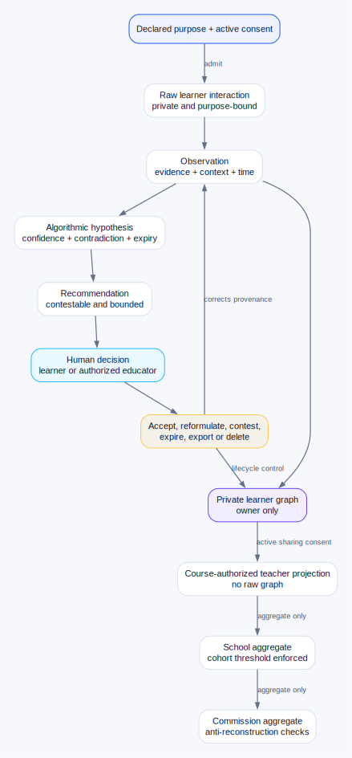
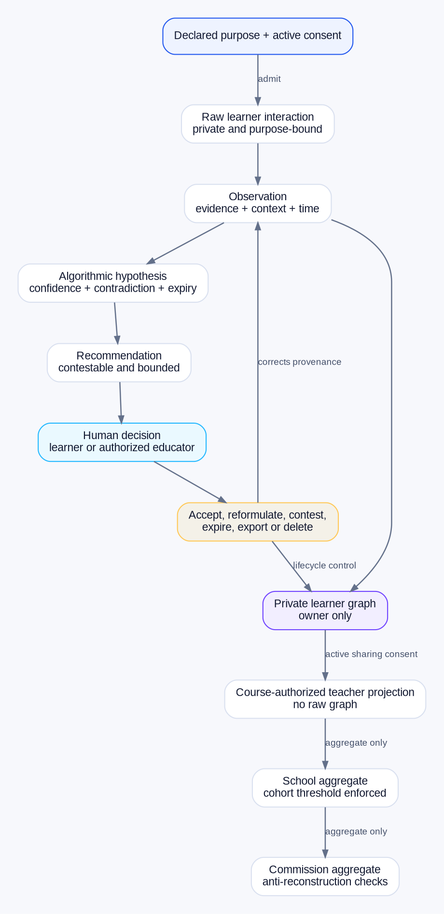

# Scholarium Teach Data Lifecycle

Caption: Figure 2. Facts, observations, hypotheses, recommendations, and human decisions remain distinct while learner controls and aggregate thresholds govern every upward projection.

