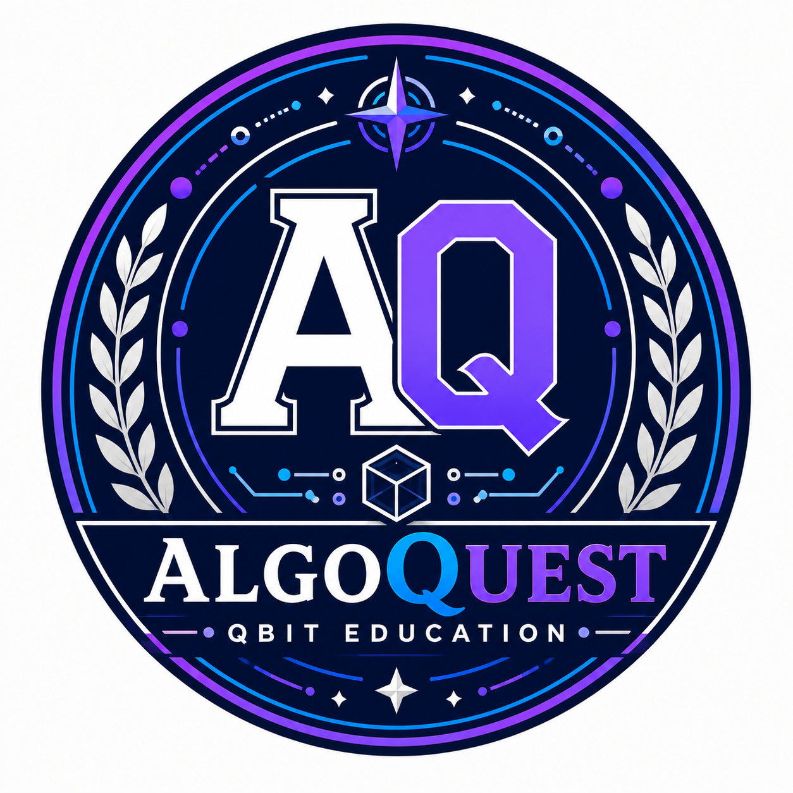

# AlgoQuest Qbit Education

<div class="se-tool-header">
  
  <div><strong>AlgoQuest Qbit Education</strong><span>public-preview · browser-app · version 0.0.0</span></div>
</div>

Interactive algorithm learning through bounded, inspectable challenges for students and teachers.

## Public status

- **Runtime:** `browser-app`
- **Availability:** `verified`
- **License:** `LicenseRef-SEL-2.0`
- **Version:** `0.0.0`

<div class="se-actions">
  <a href="https://algoquest.securedme.ca">Open tool</a>
  <a href="https://github.com/SeCuReDmE-main-dev/algoquest-ams-discovry-labs-module-">Source</a>
  <a href="https://github.com/SeCuReDmE-main-dev/algoquest-ams-discovry-labs-module-/issues">Issues</a>
</div>

## Interfaces

- React learning interface
- Teacher planning surface
- Vite development server

```{important}
Learning output is formative evidence. It is not a credential, assessment authority, or autonomous teaching decision.
```

```{toctree}
:maxdepth: 2

quickstart
architecture
interfaces
operations
```
