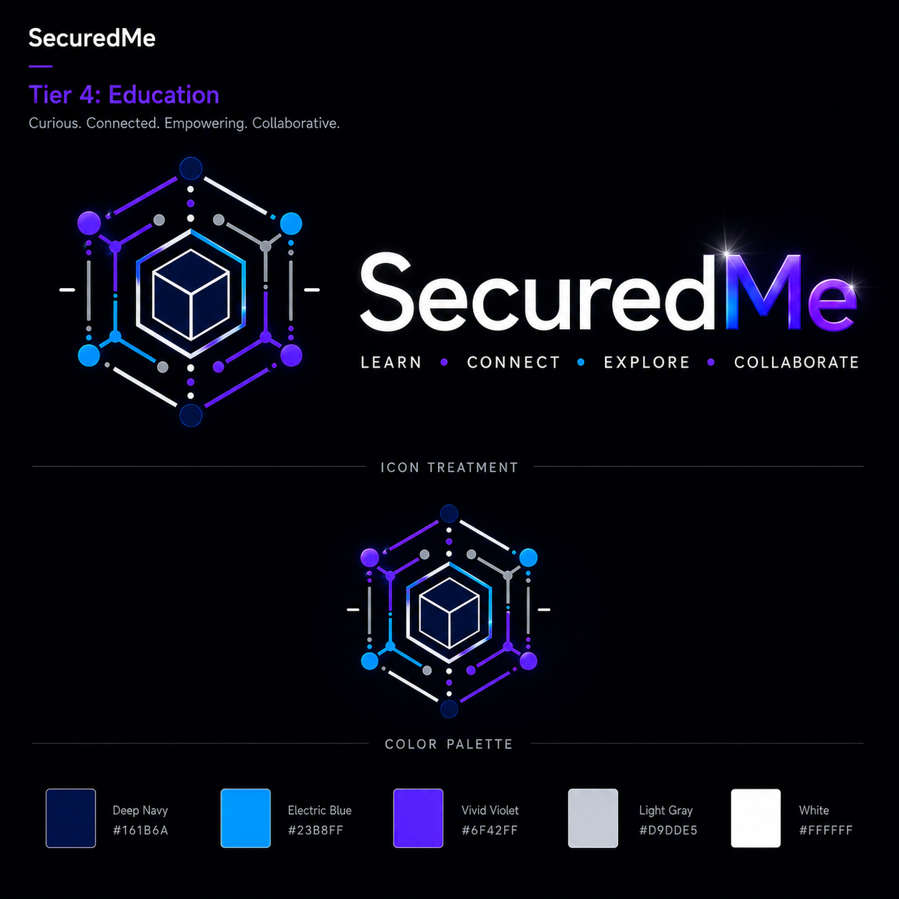

# Algorithm Builder

<div class="se-tool-header">
  
  <div><strong>Algorithm Builder</strong><span>in-development · browser-app · version 1.0.0</span></div>
</div>

A visual workspace for composing, inspecting, and explaining algorithm structures.

## Public status

- **Runtime:** `browser-app`
- **Availability:** `pending`
- **License:** `LicenseRef-SEL-2.0`
- **Version:** `1.0.0`

<div class="se-actions">
  <a href="https://algorithm-builder.securedme.ca">Open tool</a>
  <a href="https://github.com/SeCuReDmE-main-dev/algorithm-builder-app">Source</a>
  <a href="https://github.com/SeCuReDmE-main-dev/algorithm-builder-app/issues">Issues</a>
</div>

## Interfaces

- React visual builder
- Express service
- WebSocket collaboration channel

```{important}
The builder supports explanation and experimentation; generated structures remain subject to code review and tests.
```

```{toctree}
:maxdepth: 2

quickstart
architecture
interfaces
operations
```
