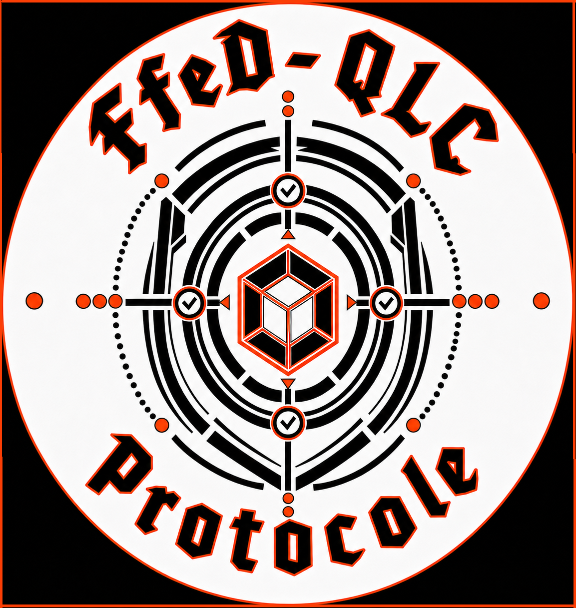

# FfeD-QLC

<div class="se-tool-header">
  
  <div><strong>FfeD-QLC</strong><span>public-preview · browser-app · version 0.1.0</span></div>
</div>

A supervised geometric-cryptography learning workbench where Vigil guides nine bounded laboratories and professors decide from reproducible evidence.

## Public status

- **Runtime:** `browser-app`
- **Availability:** `verified`
- **License:** `LicenseRef-SECL-2.0`
- **Version:** `0.1.0`

<div class="se-actions">
  <a href="https://ffed-qlc.securedme.ca">Open tool</a>
  <a href="https://github.com/SeCuReDmE-main-dev/FfeD-QLC-MVP">Source</a>
  <a href="https://github.com/SeCuReDmE-main-dev/FfeD-QLC-MVP/issues">Issues</a>
</div>

## Current alpha mechanism

`Gateway -> diagnostic -> orb project -> nine laboratories -> red/blue mission -> Vigil report -> professor decision -> portfolio`

FQLC1 uses scrypt and ChaCha20-Poly1305 as its standards floor. Exact Apollonian traces and the geometric permutation are inspectable learning mechanisms, not independent cipher or post-quantum claims. Only synthetic fixtures are admitted.

## Interfaces

- Vite student and professor workbench
- `ffed-qlc` command line
- Gateway-required FastAPI alpha surface under `/api/v1`
- Vigil reports with `accept`, `suspend`, `reject`, or revision under professor authority

```{important}
Candidate admission is a software decision trace, not proof of a physical or quantum claim.
```

```{toctree}
:maxdepth: 2

quickstart
architecture
interfaces
operations
student-path
professor-path
alpha-architecture
alpha-validation
claim-boundaries
gateway-troubleshooting
```
