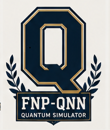

# FNP-QNN

<div class="se-tool-header">
  
  <div><strong>FNP-QNN</strong><span>public-preview · local-app · version 1.3.0a0</span></div>
</div>

A governed local simulator for repeatable mathematical and neural-network experiments.

## Public status

- **Runtime:** `local-app`
- **Availability:** `verified`
- **License:** `LicenseRef-SEL-2.0`
- **Version:** `1.3.0a0`

<div class="se-actions">
  <a href="https://fnpqnn.securedme.ca">Open technical surface</a>
  <a href="https://github.com/SeCuReDmE-main-dev/FNP-QNN-MVP">Source</a>
  <a href="https://github.com/SeCuReDmE-main-dev/FNP-QNN-MVP/issues">Issues</a>
</div>

## Interfaces

- fnp-qnn CLI
- fnp-qnn TUI
- FastAPI simulator service
- Local operator panel

```{important}
Simulation, surrogate output, and numerical agreement do not constitute physical detection or experimental validation.
```

```{toctree}
:maxdepth: 2

quickstart
architecture
interfaces
operations
```
