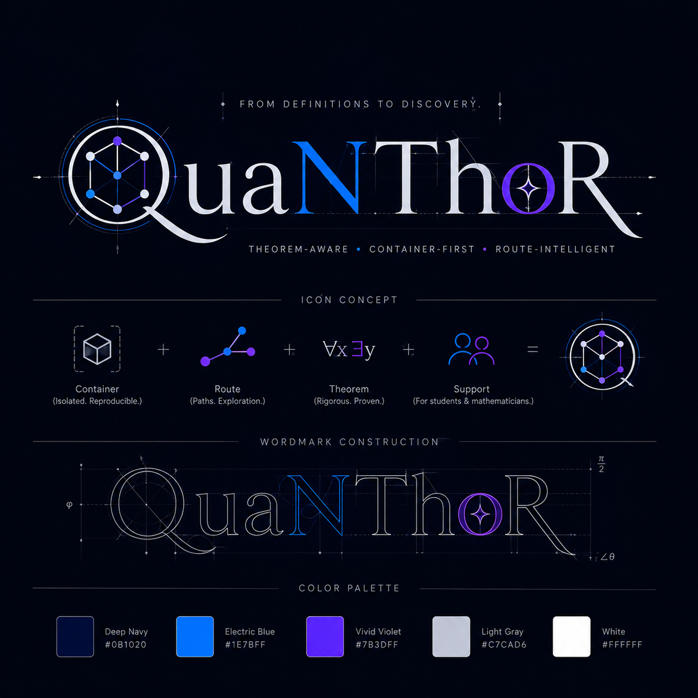

# QuaNThoR

<div class="se-tool-header">
  
  <div><strong>QuaNThoR</strong><span>public-pre-alpha · local-app · version pre-alpha</span></div>
</div>

A formalization coach that moves informal mathematical claims toward reviewable structure.

## Public status

- **Runtime:** `local-app`
- **Availability:** `verified`
- **License:** `LicenseRef-SEL-2.0`
- **Version:** `pre-alpha`

<div class="se-actions">
  <a href="https://quanthor.securedme.ca">Open technical surface</a>
  <a href="https://github.com/SeCuReDmE-main-dev/QuaNThoR">Source</a>
  <a href="https://github.com/SeCuReDmE-main-dev/QuaNThoR/issues">Issues</a>
</div>

## Interfaces

- Local proof editor
- POST /verify
- POST /route
- POST /draft
- Optional HippoRAG retrieval

```{important}
Formalization assistance does not establish a theorem until an accepted proof and qualified review exist.
```

```{toctree}
:maxdepth: 2

quickstart
architecture
interfaces
operations
```
