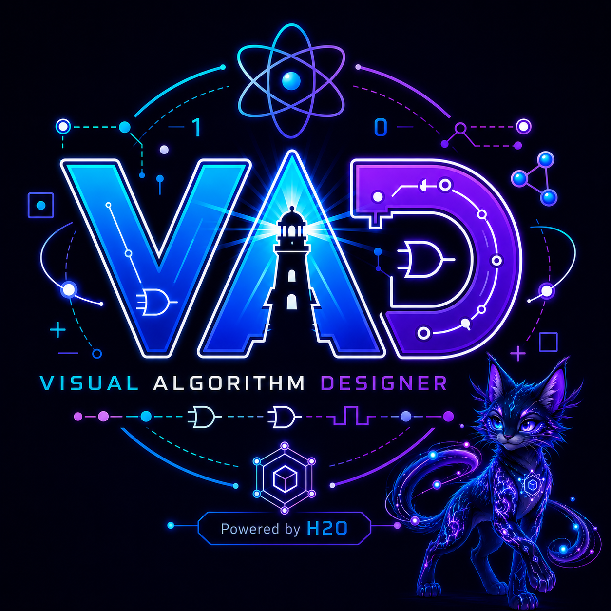

# Visual Algorithm Designer

<div class="se-tool-header">
  
  <div><strong>Visual Algorithm Designer</strong><span>public-preview · browser-app · version pre-alpha</span></div>
</div>

A visual editor for assembling, inspecting, testing, and communicating algorithms.

## Public status

- **Runtime:** `browser-app`
- **Availability:** `verified`
- **License:** `LicenseRef-SEL-2.0`
- **Version:** `pre-alpha`

<div class="se-actions">
  <a href="https://visual-algorithm.securedme.ca">Open tool</a>
  <a href="https://github.com/SeCuReDmE-main-dev/VisualAlgorithmDesigner">Source</a>
  <a href="https://github.com/SeCuReDmE-main-dev/VisualAlgorithmDesigner/issues">Issues</a>
</div>

## Interfaces

- React algorithm canvas
- Algorithm palette
- Properties and explanation panels
- Backend service

```{important}
Visual composition does not guarantee algorithmic correctness; tests and code review remain required.
```

```{toctree}
:maxdepth: 2

quickstart
architecture
interfaces
operations
```
