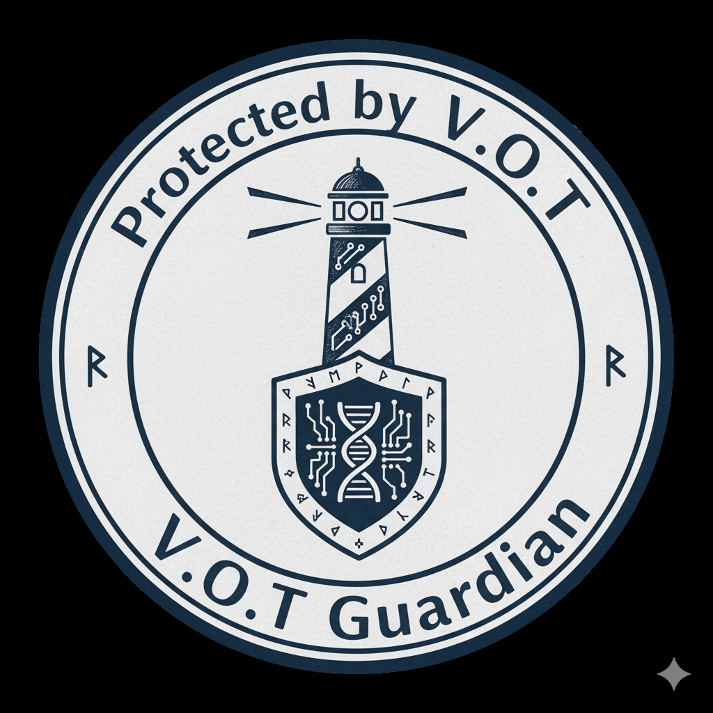

# V.O.T. Guardian

<div class="se-tool-header">
  
  <div><strong>V.O.T. Guardian</strong><span>public-preview · browser-app · version pre-alpha</span></div>
</div>

A defensive cybersecurity training surface for transparent, human-reviewed threat reasoning.

## Public status

- **Runtime:** `browser-app`
- **Availability:** `verified`
- **License:** `LicenseRef-SECL-2.0`
- **Version:** `pre-alpha`

<div class="se-actions">
  <a href="https://vot-guardian.securedme.ca">Open tool</a>
  <a href="https://github.com/SeCuReDmE-main-dev/V.O.T-Guardian">Source</a>
  <a href="https://github.com/SeCuReDmE-main-dev/V.O.T-Guardian/issues">Issues</a>
</div>

## Interfaces

- Vue defensive training UI
- Scenario review controls
- Explainable evidence surfaces

```{important}
V.O.T. Guardian must not be used for attack, surveillance, autonomous accusation, or unsupervised enforcement.
```

```{toctree}
:maxdepth: 2

quickstart
architecture
interfaces
operations
```
